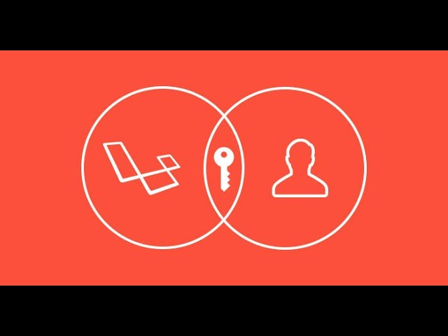
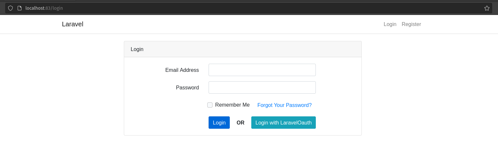
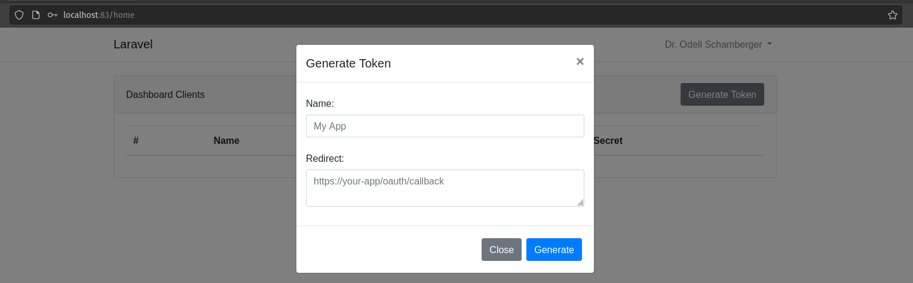
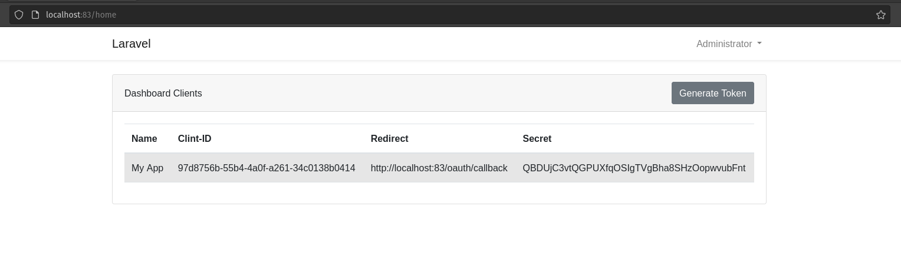
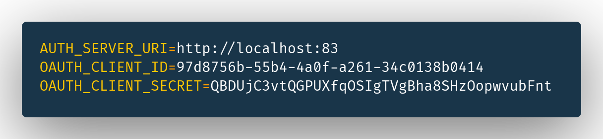
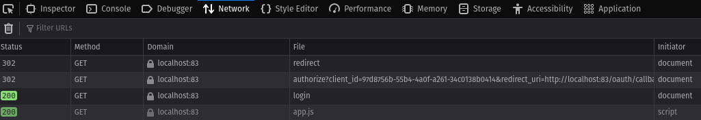

# SSO with Laravel Passport

<p align="center">
    
</p>

## Introduction

In this repository, we’re going to explore how you could set up a fully fledged OAuth2 server in Laravel using the Laravel Passport library.


## Requirement
- Docker ^19.*

## Usage

1. Click [Use this template](https://github.com/agungprsty/sso-with-laravel-passport/generate)
2. Git clone & change directory
3. Copy .env.example to .env
4. Execute the following command

```bash
$ make init # Setup project
```

## URL Application
- web: http://localhost:83
- phpmyadmin: http://localhost:82

## How To Use

### Step 1: Login to app



```
Credential:
- Email: admin@example.com
- Password: password
```
Next, click button ``Login``.


### Step 2: Generate Access Token




``Result``





### Step 3: Set Credential to .env

Copy:
- Clien-ID
- Redirect
- Secret

To .env



Next, now logout from app

### Last step

Back to page login, next click buttom ``Login with LaravelOauth``. Before do login check your network in page.




Make sure, already to access url ``authorize?client_id=<and_more>``. Next login again.

